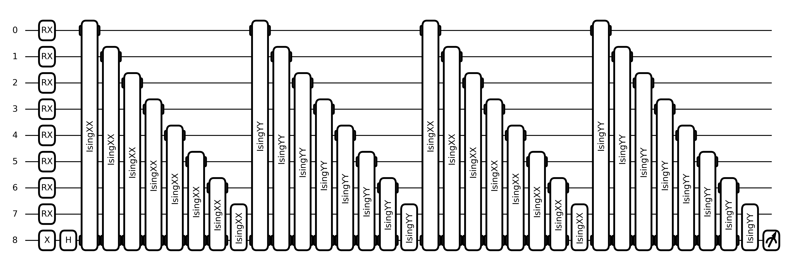
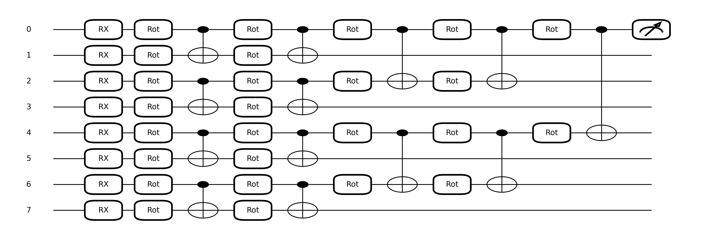
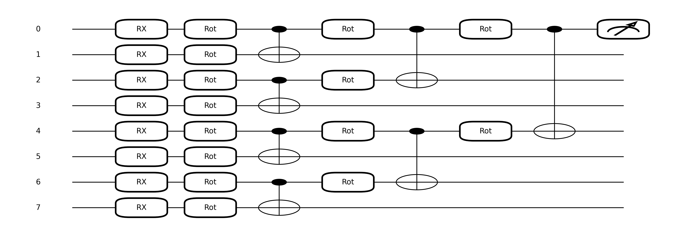
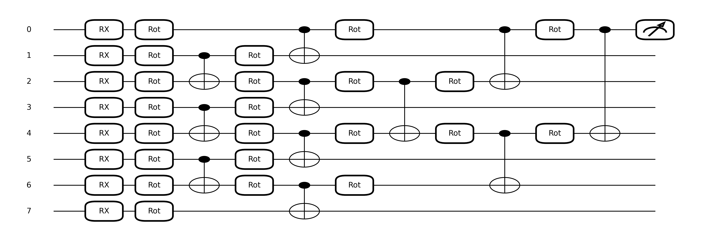

# Quantum Machine Learning for Network Anomaly Detection

## Overview 
This project investigates the use of **Quantum Neural Networks** (QNNs) for **network anomaly detection**, following the methodology presented in the paper:
[*“Network Anomaly Detection Using Quantum Neural Networks on Noisy Quantum Computers”*](https://ieeexplore.ieee.org/document/10415536).

The goal is to reproduce and analyze several QNN architectures designed to operate on **NISQ** (Noisy Intermediate-Scale Quantum) hardware, evaluating their capability to classify network traffic as benign or anomalous.

The project implements and compares four quantum models proposed in the paper:
- Simple variational circuit
- Tree Tensor Network (TTN)
- Multi-scale Entanglement Renormalization Ansatz (MERA)
- Quantum Convolutional Neural Network (QCNN)

All architectures share the same **input encoding scheme** and produce a **single-qubit measurement** used for binary classification (for more details on the architecture reference the report in the folder)

The experiments are performed using PennyLane, enabling simulation of quantum circuits and experimentation with noisy quantum devices.

### Project Structure
```
Quantum-Machine-Learning-Project/
│
├── src/
│   ├── architectures.py        # QNN architectures (Simple, TTN, MERA, QCNN)
│   ├── data_utils.py           # Data loading & splits (centralized encoder initialization)
│   ├── dataset.py              # Dataset loading and preprocessing
│   ├── draw_circuits.py        # Circuit diagram generation
│   ├── encoding.py             # Feature encoding into quantum states
│   ├── evaluate.py             # Evaluation metrics and testing
│   ├── certainty_eval.py       # Post-training certainty-factor evaluation
│   ├── certainty_noise_eval.py # Certainty evaluation under depolarizing noise
│   ├── noise_eval.py           # Noise robustness evaluation
│   ├── train_mera.py           # MERA training pipeline
│   ├── train_qcnn.py           # QCNN training pipeline
│   ├── train_simple.py         # Simple circuit training pipeline
│   ├── train_ttn.py            # TTN training pipeline
│   └── training_common.py      # Shared training logic
│
├── data/
│   ├── processed/              # Processed and balanced datasets
│   │   └── nf_unsw_balanced.csv
│   └── raw/                    # Raw datasets
│       └── NF-UNSW-NB15-v2.csv
│
├── outputs/                    # Training outputs (weights, metrics, checkpoints)
│   ├── simple/, ttn/, mera/, qcnn/   # Per-architecture training artifacts
│   ├── certainty_noiseless/           # Certainty factor evaluation outputs
│   └── certainty_noise/        # Noisy certainty evaluation outputs
│
├── results/                    # Analysis results and evaluations
│   ├── noise/                  # Noise robustness evaluation results
│
├── docs/                       # Project documentation and reports
│
├── figures/
│   └── circuits/               # Saved quantum circuit diagrams
│
├── requirements.txt
└── README.md
```

### Requirements 

1. Clone the repository:
   ```bash
   git clone https://github.com/chiarapepp/Quantum-Machine-Learning-Project.git
   ```
2. Install the required libraries:
   ```bash
   pip install -r requirements.txt
   ```
3. (Optional but recommended) Log in to Weights & Biases:
    ```bash
    wandb login
    ```

### Dataset
Place the raw dataset in `data/raw/`:
```
data/raw/NF-UNSW-NB15-v2.csv
```
To generate the processed dataset, run:
```bash
python src/dataset.py
```
The balanced CSV will be saved to `data/processed/nf_unsw_balanced.csv`. If the processed CSV is missing, the training scripts will create it automatically.

## Usage

Each architecture has its own training script. Run from the repository root:

```bash
python src/train_simple.py
python src/train_ttn.py
python src/train_mera.py
python src/train_qcnn.py
```

All training scripts share a common set of arguments. Example with custom options:

```bash
python src/train_simple.py --epochs 20 --lr 0.005 --batch-size 32 --optimizer adam --save-best-weights
```

### Fixed Parameters (Data, Split, Reproducibility, Outputs)

These are the arguments you typically keep fixed across runs:

- `--processed-csv` (default: `data/processed/nf_unsw_balanced.csv`) → processed dataset path
- `--raw-csv` (default: `data/raw/NF-UNSW-NB15-v2.csv`) → raw dataset path used if processed CSV is missing
- `--test-size` (default: `0.15`) → test split fraction
- `--val-size` (default: `0.15`) → validation split fraction (of the training split)
- `--n-bins` (default: `100`) → number of percentile bins for quantum encoding
- `--random-state` (default: `1`) → split reproducibility
- `--seed` (default: `123`) → initialization reproducibility
- `--save-dir` (default: `outputs/<arch>`) → output directory for metrics and weights

### Weights & Biases (Optional)

You can customize logging with:

- `--wandb-project` to choose the project name
- `--wandb-run-name` to set a custom run name

If not provided, run naming is handled automatically.

### Training Configuration

| Argument | Default | Description |
|---|---|---|
| `--epochs` | `10` | Number of training epochs. Increase for longer training, reduce for quick tests. |
| `--lr` | `0.01` | Learning rate. |
| `--batch-size` | `16` | Mini-batch size. |
| `--optimizer` | `adam` | Optimizer type: `adam` or `sgd`. |
| `--sgd-momentum` | `0.0` | SGD momentum (used only when `--optimizer sgd`; allowed: `0.0`, `0.2`, `0.3`). |
| `--sgd-decay` | `0.0` | SGD decay rate (used only when `--optimizer sgd`. |
| `--save-best-weights` | `False` | If enabled, saves the best validation weights to disk. |
| `--n-layers` | `2` | Number of variational layers; available only in `train_simple.py`. |
| `--layer-type` | `XXYY` | Entangling layer type for `train_simple.py`: `XXYY`, `ZZXX`, `ZZYY`, or `ZZXXYY`. |

### Visualization
To visualize the quantum circuits:
```bash
python src/draw_circuits.py
```
| Simple circuit | QCNN circuit  |
|---------------|----------------|
|  |  |

| TTN circuit | MERA circuit  |
|---------------|----------------|
|  |  |

## Post-Training Evaluation & Analysis

After training it's possible to evaluate model robustness, certainty metrics, and performance under noise.

### Noise Robustness Evaluation
Evaluate trained raw weights under configurable depolarizing noise conditions:
```bash
python src/noise_eval.py \
  --weights outputs/simple/best_weights.npy \
  --n-layers 2 \
  --layer-type XXYY \
  --data_csv data/processed/nf_unsw_balanced.csv \
  --shots 200 \
  --batch_size 32 \
  --mode shots
```

Key arguments:
- `--weights`: Path to raw `.npy` weight file
- `--n-layers`: Number of variational layers (required when using `--weights`)
- `--layer-type`: Entangling layer type (`XXYY`, `ZZXX`, `ZZYY`, `ZZXXYY`)
- `--levels`: Noise levels to evaluate (default: all predefined levels)
- `--mode`: Inference mode (`expval` or `shots`)
- `--shots`: Number of measurement shots (for `--mode shots`)
- `--two_qubit_scale`: Scale two-qubit noise relative to single-qubit noise
- `--output`: Path to save results JSON

Note: this script currently supports only the `simple` architecture.

Output: Aggregated metrics (F1, accuracy, AUC) across noise levels saved to JSON.

### Certainty Factor Evaluation (Noiseless Environment)
Analyze prediction certainty and confidence on trained weight files:
```bash
python src/certainty_eval.py \
  --arch simple \
  --weights-path outputs/simple/final_weights.npy \
  --split test \
  --n-layers 2 \
  --layer-type XXYY \
  --save-dir outputs/certainty
```

Key arguments:
- `--arch`: Architecture type (`simple`, `ttn`, `mera`, `qcnn`)
- `--weights-path`: Path to trained `.npy` weights file
- `--split`: Data split to evaluate (`train`, `val`, `test`)
- `--threshold`: Decision threshold for binary classification (default: `0.0`)
- `--n-bins`: Number of encoding bins (default: `100`, must match training)
- `--save-dir`: Output directory for results
- `--save-prefix`: Custom prefix for output files

Outputs:
- `{prefix}_samples.csv`: Per-sample predictions and certainty factors
- `{prefix}_summary.json`: Aggregate metrics and certainty statistics
- `{prefix}_violin.png`: Distribution of certainty factors across predictions
- `{prefix}_hist.png`: Histogram of certainty for correct vs. incorrect predictions

### Certainty Factor Evaluation Under Noise
Evaluate prediction certainty under synthetic depolarizing noise:
```bash
python src/certainty_noise_eval.py \
  --weights-path outputs/simple/final_weights.npy \
  --n-layers 2 \
  --layer-type XXYY \
  --split test \
  --noise-level medium \
  --mode shots \
  --shots 200 \
  --save-dir outputs/certainty_noise
```

Key arguments:
- `--weights-path`: Path to trained `.npy` weights file (required)
- `--n-layers`: Number of variational layers (required)
- `--layer-type`: Entangling layer type (`XXYY`, `ZZXX`, `ZZYY`, `ZZXXYY`)
- `--noise-level`: Noise severity (`clean`, `very_low`, `low`, `medium`, `high`, `very_high`)
- `--mode`: Inference mode (`expval` for expectation values, `shots` for measurement averaging)
- `--shots`: Number of measurement shots per inference (used when `--mode shots`)
- `--two-qubit-scale`: Scale factor for two-qubit gate noise (default: `1.0`)
- `--batch_size`: Batch size for evaluation (default: `32`)
- `--save-dir`: Output directory for results

Outputs: Same structure as **Certainty Factor Evaluation**, with noise level metadata in files and JSON summary.

## Documentation & Analysis

For comprehensive analysis, visualizations, and detailed results, please refer to the project report in the `docs/` folder. The report includes:
- Detailed performance comparison across architectures;
- Noise robustness analysis;
- Certainty factor distributions and statistical summaries.

For additional experiment tracking logs, a [Weights & Biases workspace](https://wandb.ai/chiara-peppicelli-university-of-florence/qml-project?nw=nwuserchiarapeppicelli) is also available.

## References

- [Dataset: NF-UNSW-NB15-v2 (NetFlow-based network intrusion detection) ](hhttps://espace.library.uq.edu.au/view/UQ:ffbb0c1) *, The University of Queensland.* 
- [Network Anomaly Detection Using Quantum Neural Networks on Noisy Quantum Computers](https://ieeexplore.ieee.org/document/10415536)*, Kukliansky et al., IEEE Transactions on Quantum
Engineering, 5:1–11, 2024.*


